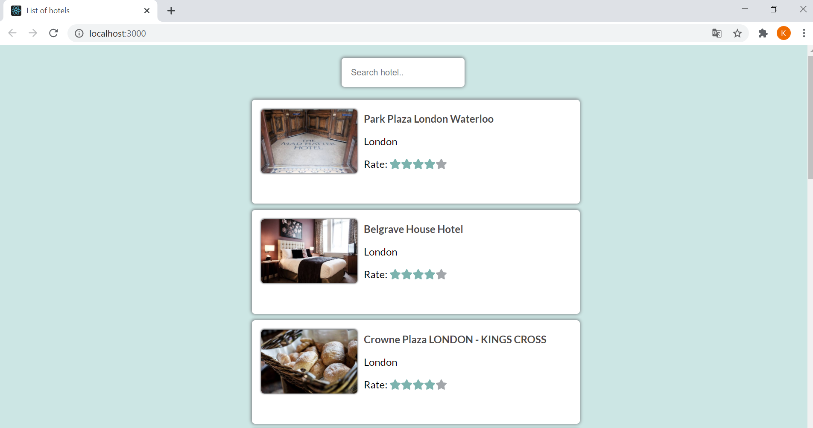

# List of hotels App

In the project directory, you can run:

### `yarn install`

### `yarn start`

To run all the tests:

### `yarn test`

## Description

This project was bootstrapped with Create React App.

The website is written in React. There is a list of hotels with a search engine. The components are properly tested.
